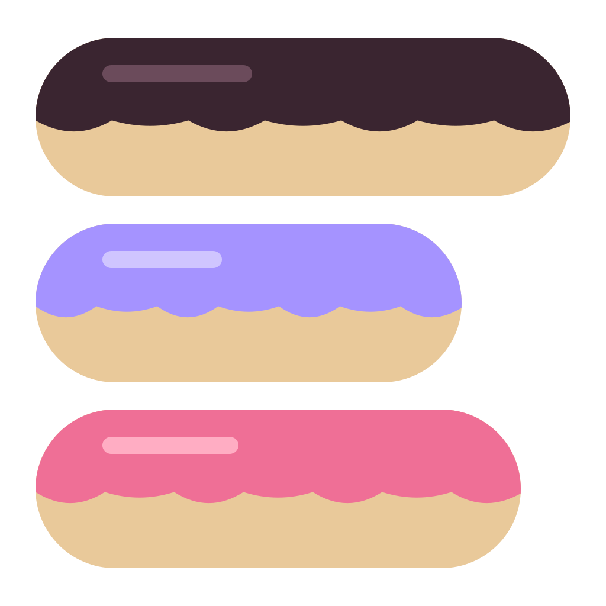

<p align="center"></p>

# Melclair 멜클레어

좋아하는 노래의 한 장면을 **가사 카드 · 움짤(GIF) · 영상(MP4)** 으로 만드는 웹 도구입니다.
그림을 넣고 가사를 고르면, 음악 플레이어나 CD, 동영상 화면처럼 꾸며서 저장할 수 있어요.

설치 없이 브라우저에서 바로 씁니다. 넣은 그림과 노래는 내 컴퓨터 밖으로 나가지 않습니다.

**[바로 쓰기 → bitcuit.github.io/Melclair](https://bitcuit.github.io/Melclair/)**

## 만들 수 있는 것

**세 가지 모양**

- **음악 플레이어** — 앨범 아트 아래 가사, 재생바와 버튼
- **CD 플레이어** — 그림이 입혀진 디스크가 돌고, 그 아래 제목과 가사
- **동영상** — 영상 화면에 자막처럼 가사, 아래에 채널·좋아요 줄

**저장 형식**

| 형식 | 소리 | 쓰는 곳 |
|---|---|---|
| MP4 | 있음 | 노래와 함께 올릴 때 |
| GIF | 없음 | 움짤로 올릴 때 |
| PNG · JPG | — | 가사 줄이나 문단마다 한 장씩 |

## 쓰는 법

1. 맨 위에서 **모양**을 고릅니다.
2. **이미지** — 사진을 넣고, 가운데 그림을 끌어 위치를 맞추고 휠로 크기를 맞춥니다. 여러 장이면 몇 초마다, 또는 가사 줄이 바뀔 때마다 바뀝니다.
3. **노래** — 제목과 가수를 쓰고 노래 파일(mp3 · m4a · wav)을 넣은 뒤, 아래 물결 모양에서 쓸 부분을 고릅니다. 노래 없이 만들어도 됩니다.
4. **가사** — *가사 찾기*로 박자가 붙은 가사를 받아 오거나 직접 붙여넣습니다. 줄을 누르면 발음과 번역을 달 수 있고, 시각도 0.1초씩 맞출 수 있습니다.
   가사 아래에 `[번역]` `[발음]` 줄을 붙여 넣으면 바로 위 가사 줄에 붙습니다.
5. **꾸미기** — 글꼴과 가사 스타일(상자 · 테두리 · 빛), 주변 빛, 글리치, 보케, 필름 · VHS 느낌, 스티커.
6. 오른쪽 위 **내보내기**에서 저장합니다. 일부분만 저장하려면 *구간만 저장*을 켭니다.

화면의 **?** 버튼에 같은 설명이 있습니다.

**단축키** — `Space` 재생 · 멈춤, `←` `→` 앞뒤 장면, `Delete` 고른 스티커 지우기

## 저장할 때 알아 둘 것

- **MP4 저장은 크롬 · 엣지에서** 됩니다(브라우저의 영상 인코딩 기능을 씁니다). 다른 브라우저는 확인하지 않았습니다.
- **GIF에는 소리가 들어가지 않습니다.** 소리까지 올리려면 MP4로 저장하세요.
- 트위터 GIF는 **350장, 15MB**까지 올라갑니다. 넘으면 초당 장 수를 자동으로 낮추고, 저장 뒤 용량이 넘으면 알려 줍니다.
- 미리보기 오른쪽 위 **눈 모양**을 끄면 효과가 숨고, 저장할 때도 숨긴 채로 나옵니다.

## 내 정보는 어디로 가나요

- 넣은 그림 · 노래 파일 · 스티커는 **브라우저 안에서만** 처리되고 어디에도 올라가지 않습니다.
- *가사 찾기*를 누를 때만 제목과 가수 이름이 가사 사이트 [LRCLIB](https://lrclib.net)로 보내집니다.
- 글꼴은 Google Fonts와 jsDelivr에서 받아 옵니다. 직접 추가한 웹폰트는 그 주소에서 받아 옵니다.
- 설정과 가사는 이 브라우저에만 저장됩니다(다른 기기와 공유되지 않음).

## 직접 열기

빌드할 것이 없는 정적 페이지입니다. `index.html`을 브라우저로 열면 바로 됩니다.
깃허브 페이지에 올릴 때도 이 폴더 그대로 올리면 됩니다.

```
index.html      화면
app.js          그리기 · 저장 · 편집 기능 전부
icon.svg        아이콘
vendor/         GIF · MP4 만들기 라이브러리
```

## 함께 쓴 것

| 이름 | 쓰는 곳 | 라이선스 |
|---|---|---|
| [gifenc](https://github.com/mattdesl/gifenc) | GIF 만들기 | MIT |
| [mp4-muxer](https://github.com/Vanilagy/mp4-muxer) | MP4 묶기 | MIT |
| [LRCLIB](https://lrclib.net) | 박자 붙은 가사 찾기 | — |
| Noto Sans KR · Noto Serif KR | 카드 기본 글꼴 (Google Fonts) | SIL Open Font License 1.1 |
| Hahmlet | 편집 화면 제목 (Google Fonts) | SIL Open Font License 1.1 |
| [Pretendard](https://github.com/orioncactus/pretendard) | 화면 글꼴 | SIL Open Font License 1.1 |

가사와 노래, 그림의 저작권은 각 권리자에게 있습니다. 만든 결과물을 올릴 때는 저작권을 확인해 주세요.
